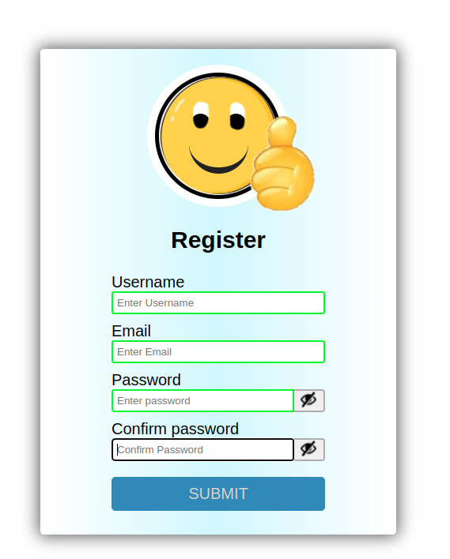

It may seem like a simple registration form but in addition there is a nice smiley that follows you in your movements and tells you if you are wrong or if you write correctly.
All done in pure html, css and javascript without the help of any library.

Try it => https://lucapu88.github.io/pure-css-js-dinamic-smile-form/

